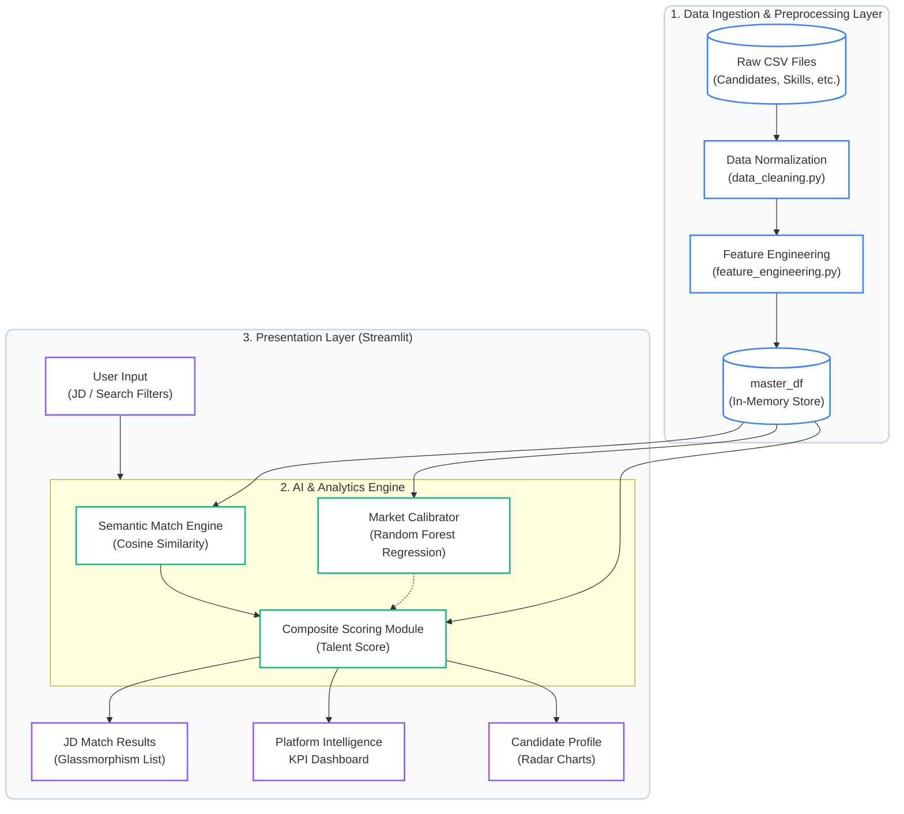

## 7. System Architecture

The Talent Intelligence Platform is designed as a decoupled, multi-tier web application that seamlessly integrates data processing, machine learning inference, and interactive data visualization. The architecture is engineered to handle multi-relational candidate datasets and execute sub-second analytical queries entirely in-memory. The system is built primarily on the Python ecosystem, utilizing Streamlit for the frontend, Pandas and Scikit-Learn for the data and ML pipelines, and custom NLP modules for semantic processing.

The architecture can be logically divided into three distinct layers: the Data Layer, the AI/Analytics Engine, and the Presentation Layer.

### 7.1 Data Ingestion and Preprocessing Layer
The foundational tier of the architecture manages the ingestion, normalization, and relational mapping of candidate data. 
*   **Data Sources (`load_data.py`):** The system ingests data from a suite of highly structured CSV files, representing disparate domains such as career history (`career_df`), technical skills (`skills_df`), academic qualifications (`education_df`), professional certifications (`certifications_df`), and cognitive assessments (`assessments_df`).
*   **Data Normalization (`data_cleaning.py`):** Raw data is passed through a preprocessing pipeline that handles missing values, imputes median values for numerical outliers, and standardizes categorical text to ensure consistency before algorithmic evaluation.
*   **Feature Engineering (`feature_engineering.py`):** This module synthesizes raw data into quantifiable metrics. It aggregates distinct relational tables to compute overarching numerical features such as `total_skills`, `companies_worked`, and `years_of_experience`, culminating in a unified `master_df` (Master DataFrame) that serves as the single source of truth for the application.

### 7.2 Artificial Intelligence and Analytics Engine
This middle tier contains the core algorithmic intelligence of the platform, consisting of three primary subsystems:
*   **Semantic Matching Engine (`hidden_talent_engine.py`):** This NLP component processes unstructured text, primarily candidate summaries and Job Descriptions (JDs). It utilizes dense vector embeddings and text-similarity algorithms to compute a contextual overlap score, allowing the system to recognize semantic equivalence independent of exact keyword matches.
*   **Predictive Market Calibrator (`market_value_predictor.py`):** A machine learning regression pipeline trained on structured candidate features (e.g., experience, skill count, assessment scores). At runtime, it ingests a candidate's specific feature vector and outputs a continuous variable representing their `Predicted Salary`, enabling real-time financial fairness evaluations.
*   **Composite Scoring Module (`talent_score_breakdown.py`):** A weighted aggregation algorithm that synthesizes the output of the Semantic Engine, the candidate's structured assessment scores, and dynamic metrics like `Learning Velocity`. It produces the final, normalized **Talent Score** (scaled 0-100) used for competitive ranking.

### 7.3 Presentation and Visualization Layer (Frontend)
The user-facing tier is implemented as a stateful, interactive web application using Streamlit (`app.py`). 
*   **Component Architecture:** The interface is modularized into distinct analytical views: an enterprise KPI Dashboard ("Platform Intelligence"), an individual Candidate Profile view featuring side-by-side Radar Charts, a Top Candidates leaderboard, and a dedicated "JD Match" workflow interface.
*   **UI/UX Design (Glassmorphism):** Moving away from standard HTML layouts, the frontend utilizes extensive custom CSS injection to achieve a premium "Glassmorphism" aesthetic. This involves semi-transparent overlay cards, backdrop-filters, modern typography, and color-coded progress bars that dynamically reflect candidate scores.
*   **State Management for Optimization:** The application leverages Streamlit's `session_state` to cache heavy machine learning computations. For instance, once the semantic JD Match calculates scores for the entire candidate pool, the resulting DataFrame is stored in memory. This allows recruiters to instantly apply post-calculation filters (e.g., "Score > 80") without re-triggering the ML inference pipeline, ensuring a frictionless user experience.

### 7.4 Architectural Process Flow
The end-to-end execution flow of the system during a standard operation (such as evaluating candidates against a new Job Description) proceeds as follows:
1.  **User Input:** The HR professional inputs a natural language Job Description into the Presentation Layer.
2.  **Inference Trigger:** The application triggers the Semantic Engine, iterating over the pre-loaded `master_df` in-memory.
3.  **Algorithmic Synthesis:** For each candidate, the Semantic Engine calculates text similarity, the Regression Engine predicts market salary, and the Scoring Module computes the final Talent Score.
4.  **UI Rendering:** The aggregated results are sorted and returned to the Presentation Layer, where they are dynamically rendered into interactive list views and comparative radar charts for the user.

### 7.5 Architecture Diagram

